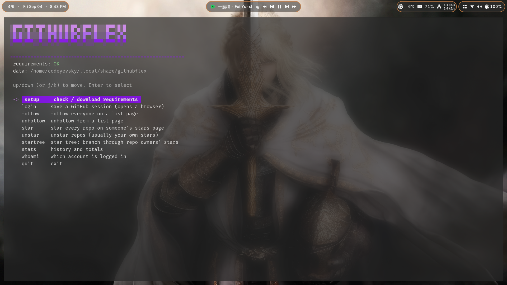

<p align="center">
  
</p>

<p align="center">
  <a href="https://github.com/codeyevsky/ghFlex/releases"></a>
  <a href="https://github.com/codeyevsky/ghFlex/stargazers"></a>
  
  
</p>

# githubFlex

githubFlex is an interactive terminal tool that makes it easy to **"flex"** on
other developers on GitHub. It walks GitHub list pages and acts on every entry:
**follow** the people on a followers/following/stargazers page, **unfollow**
them again, **star** every repo on someone's stars page, and **unstar** your own
stars.

There are no subcommands or flags. You run one binary and everything happens
inside an interactive panel. It drives a real browser through Playwright, so it
uses your normal logged in GitHub session and never asks for an API token. Works
with Firefox and Chromium on Linux, macOS and Windows.

<p align="center">
  
</p>

## Install

With Go 1.25+ installed:

```bash
go install github.com/codeyevsky/ghFlex@latest
```

or build from a clone:

```bash
git clone https://github.com/codeyevsky/ghFlex.git
cd ghFlex
go build -o bin/ghflex .
```

That is the only thing you ever type in a shell. Everything else, including
downloading the browser requirements, is done from inside the panel.

## Updating

Pick **`update`** in the panel to get the newest version. It runs
`go install github.com/codeyevsky/ghFlex@latest` for you (Go must be on PATH),
then asks you to restart githubFlex. If you built from a clone instead, run:

```bash
git pull && go build -o bin/ghflex .
```

## Releases

Every tagged version is on the [Releases page](https://github.com/codeyevsky/ghFlex/releases)
with prebuilt binaries for Linux, macOS and Windows. Download the one for your
OS, or install a specific version with Go:

```bash
go install github.com/codeyevsky/ghFlex@v0.1.0
```

Maintainers cut a release by pushing a version tag; GitHub Actions then builds
the binaries and publishes the release automatically:

```bash
git tag v0.1.1
git push origin v0.1.1
```

## First run

Run the binary with no arguments.

### From a clone

```bash
./bin/ghflex
```

### From `go install`

```bash
ghFlex
```

The first-time flow, all inside the panel:

1. **`setup`** checks whether the requirements are already downloaded and tells
   you what is missing:

   ```
     checking requirements...
     Requirements:
       playwright driver : OK
       firefox           : missing
       chromium          : missing
     Download the missing pieces now? (Y/n):
   ```

   Answer `y` (or just press Enter) and it downloads the Playwright driver and
   the browsers for your OS, a one time download of a few hundred MB. Re-run
   `setup` any time to re-check; the panel header also shows the result of the
   last check.
2. **`login`** opens a browser window on github.com/login. Sign in normally
   (2FA included). The panel detects the login and saves the session in a
   dedicated profile, so you only do this once.
3. Pick an action (`follow`, `unfollow`, `star`, `unstar`), answer the prompts,
   watch it run.

## How an action works

Choosing `follow`, `unfollow`, `star` or `unstar` asks a short series of
questions. Arrow-key choosers (`browser`, `speed`, `dry run`) start on a
sensible default; text and number prompts show their default in brackets, so
pressing Enter accepts it.

| Prompt | Meaning |
| --- | --- |
| `browser` | `firefox` or `chromium` (arrow keys) |
| `target` | follow / star only: whose list to walk (see below) |
| `pages to walk` | how many list pages to go through (digits only) |
| `max follows` / `max stars` | hard cap for this run, named per action (digits only) |
| `speed` | delay preset (arrow keys) |
| `dry run` | `yes` prints what would happen without touching anything |

The `speed` preset controls the pause between actions:

| Preset | Between actions | Between pages |
| --- | --- | --- |
| `slow` | 2 to 4 s | 3 s |
| `medium` | 0.6 to 1.4 s | 1 s |
| `fast` | 0.15 to 0.45 s | 0.3 s |

While moving the cursor onto `fast` (before you confirm), a live warning appears
next to it that it can trip GitHub's rate limit sooner. `slow` is the cautious
choice for large unattended runs.

If GitHub does throttle the run, githubFlex **does not crash**. It stops
cleanly, keeps whatever it already did, and prints a clear notice:

```
  !! GitHub usage limit reached (rate limited).
     You've hit GitHub's action limit. Wait ~30 minutes
     before trying again to keep your account safe.
```

It then asks whether to **wait and retry every 5 minutes until the limit
clears**. Choose `yes` and it keeps the browser open, waits 5 minutes, and
retries with the leftover budget. Already followed or starred entries are
skipped automatically, so it resumes where it stopped and never exits on its own
(Ctrl-C to stop). Choose `no` and you return to the panel. An unexpected error
in any run is caught the same way, so the panel itself never dies.

The tool opens the target page, acts on every visible entry, waits the chosen
delay, then moves to the next page. A browser window is visible the whole time,
so you can watch exactly what it does. Numeric prompts reject non-digit
characters, and only follow/star ask for a target.

**Always try a dry run first.** It lists who would be followed or which repos
would be starred without doing anything.

### Targets

Only **follow** and **star** ask for a target, because they act on someone
else's list. **unfollow** always walks your own following list and **unstar**
your own stars, so they skip the target question and go straight to the `pages`
prompt.

The target prompt takes a full GitHub URL or one of these shortcuts:

| Shortcut | Page it opens |
| --- | --- |
| `user:followers` | `github.com/user?tab=followers` |
| `user:following` | `github.com/user?tab=following` |
| `user:stars` | `github.com/user?tab=stars` |
| `owner/repo:stargazers` | `github.com/owner/repo/stargazers` |
| `owner/repo:watchers` | `github.com/owner/repo/watchers` |

`me` always means the account you are logged in as:

* `me:following` is your own following list (the usual target for **unfollow**)
* `me:stars` is your own stars page (the usual target for **unstar**)

Typical uses:

* *Follow the people who follow someone*: action `follow`, target
  `torvalds:followers`.
* *Star the repos someone has starred*: action `star`, target `torvalds:stars`.
* *Undo it later*: action `unfollow` with `me:following`, or `unstar` with
  `me:stars`.

### startree: branching through the star graph

`startree` walks the star graph breadth first. It stars the repos the root user
starred, and for every starred repo it queues the repo's **owner** and walks
their stars page next, branching level by level:

```
  -> depth 0: stars of torvalds
       [*] libgit2/libgit2  (1/30)
       [*] user1/repo1      (2/30)
      -> depth 1: stars of libgit2
           [*] someone/rust-thing  (3/30)
      -> depth 1: stars of user1
           ...
```

Its prompts: root user, branch depth (`0` = only the root's stars), pages per
user, max stars total, dry run. The total cap applies to the whole tree, so a
small `max stars total` keeps a deep tree harmless. Organizations can't star
anything, so those branches just end quietly. Everything it stars is recorded
and can be undone later with `unstar` on `me:stars`.

### What each entry means while it runs

```
  [+] alice        followed        [*] owner/repo   starred
  [-] alice        unfollowed      [x] owner/repo   unstarred
  ?   name: HTTP 404, skipped      [dry-run] would follow name
```

## Stats

The `stats` entry shows totals, the last five runs and the last ten
follows/stars, all read from local state, no browser needed.

## Safety and limits

* Actions are spaced apart by the chosen `speed` preset, with a pause between
  pages.
* The run **stops immediately** when GitHub answers with a limit response
  (HTTP 422/429/403, or an abuse / rate limit page), and after 5 failures in a
  row.
* The account whose profile is being walked is never followed or unfollowed.
* Automating your account is subject to GitHub's Terms of Service; large
  unattended runs can get an account flagged regardless of tooling. Keep the
  per-run cap modest, keep the built-in delays, and prefer a dry run first.

## Where data lives

Everything is stored under `$XDG_DATA_HOME/githubflex` (default
`~/.local/share/githubflex`). If you upgraded from the old `gh-autofollow` tool,
its directory is renamed to `githubflex` automatically on first run. Override
the location with the `GITHUBFLEX_HOME` environment variable.

| File | Contents |
| --- | --- |
| `state.json` | followed users, starred repos, run history |
| `blocklist.txt` | one user or `owner/repo` per line, never touched |
| `profiles/` | the dedicated browser profiles holding your GitHub session |

To protect specific accounts or repos from ever being acted on, create
`blocklist.txt` and add one name per line (`#` starts a comment).

## Development

```bash
go build -o bin/ghflex .   # build
go vet ./...               # static checks
```

Layout:

| Path | Role |
| --- | --- |
| `main.go` | interactive panel, prompts, requirement check, retry loop |
| `ui.go` | banner, colours, animation, arrow-key choosers |
| `internal/style/color.go` | shared terminal colour helpers |
| `internal/engine/modes.go` | action definitions |
| `internal/engine/collect.go` | form collection, submit, rate-limit detection, paging |
| `internal/engine/run.go` | the page-walking engine (follow/unfollow/star/unstar) |
| `internal/engine/startree.go` | breadth-first star tree |
| `internal/engine/browser.go` | Playwright launch, persistent profiles, login detection |
| `internal/engine/state.go` | state file, blocklist, data directory |

## Troubleshooting

* **"playwright driver not ready"**: run the `setup` entry to download the
  requirements.
* **"not logged in"**: run the `login` entry and sign in once; the session
  persists between runs.
* **Login window closed too early / session expired**: just run `login` again.
* **Corporate proxy / mirror**: the downloads honor the standard
  `PLAYWRIGHT_DOWNLOAD_HOST`, npm registry and `NODE_MIRROR` overrides.
